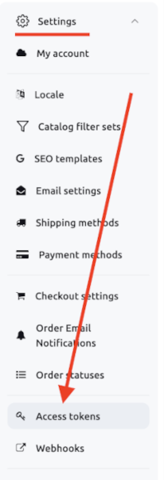
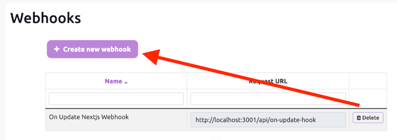

# Next.js v14 

Ready to use [Next.js](https://nextjs.org) v14 (TypeScript) E-commerce Starter Kit

Free 👍. Ready to use 😎. Just clone & deploy! 🤘

## Features

- [x] Next.js v14 - The new App router
- [x] 3 different checkout flows - it gives you tips about own checkout flow implementation and payment gateway integration.
- [x] Stripe Checkout
- [x] Boundless Checkout with PayPal
- [x] Custom Checkout form
- [x] Authentication: Sign Up, Sign In, Password Restore, Sign out
- [x] My orders page
- [x] Boundless Webhook handler: on Update/Insert/Delete appropriate cache will be invalidated
- [x] Simple codebase without complex dependencies (no Redux and other code coherence)

## Online Demo ⚡️

[nextjs-ecommerce-starter-kit.vercel.app](https://nextjs-ecommerce-starter-kit.vercel.app)

## About Boundless Commerce

[Boundless-commerce.com](https://boundless-commerce.com/) - API’s First Headless E-commerce CMS: We Provide An
Admin-Side For Store Management, Powerful API, And Ready-To-Use Checkout Area.

## Self-Hosted solution

There is an option for Running Boundless-Commerce on your own server. Read more at [Open-Source Headless eCommerce Platform](https://boundless-commerce.com/open-source)

## Getting Started

1. Go to [Boundless-commerce.com](https://boundless-commerce.com/) and create a free account (no credit card required).
2. Go to "Control panel" -> "Settings" -> "Access tokens" and create a new one:

3. Copy `.env.example` to `.env.local`
4. Modify `.env.local`: put values for the `NEXT_PUBLIC_BOUNDLESS_API_PERMANENT_TOKEN` and `NEXT_PUBLIC_BOUNDLESS_INSTANCE_ID`, copy values from:

If you want to use Stripe, put values for `NEXT_PUBLIC_STRIPE_PUBLISHABLE_KEY`, `STRIPE_SECRET_KEY` and `BOUNDLESS_MANAGEMENT_TOKEN`.

`BOUNDLESS_MANAGEMENT_TOKEN` it is token like `NEXT_PUBLIC_BOUNDLESS_API_PERMANENT_TOKEN`, but management rights should be enabled. 

5. Install dependencies: `npm install`
6. `npm run dev` - to start locally, then open `http://localhost:3000`

## Set Up Webhook Handler

1. Go to "Control panel" -> "Settings" -> "Webhooks" and create a new one:

2. Create a new webhook:

You need to specify absolute URL to the webhook handler, e.g.: `http://localhost:3000/api/on-update-hook`. Then specify a secret key and put it as an ENV variable: `WEBHOOK_SIGN_KEY`.

3. Save.

---

[NextJS and React eCommerce templates](https://boundless-commerce.com/templates) - Free. Ready to use. Just clone & deploy!
